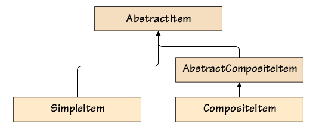

# Usage
There are two kind objects: composite and noncomposite object. These two objects have same core methods.
And composite have additional methods to add, remove, iterate their child objects. The child objects can be
composite and noncomposite.


# Way to realize

1. Classs way(two base class)
Composite and noncomposite object use different class to relize.

```python
def main():
    pencil = SimpleItem("Pencil", 0.40)
    ruler = SimpleItem("Ruler", 1.60)
    eraser = SimpleItem("Eraser", 0.20)
    pencilSet = CompositeItem("Pencil Set", pencil, ruler, eraser)
    box = SimpleItem("Box", 1.00)
    boxedPencilSet = CompositeItem("Boxed Pencil Set", box, pencilSet)
    boxedPencilSet.add(pencil)
    for item in (pencil, ruler, eraser, pencilSet, boxedPencilSet):
        item.print()


class AbstractItem(metaclass=abc.ABCMeta):

    @abc.abstractproperty
    def composite(self):
        pass


    def __iter__(self):
        return iter([])


class SimpleItem(AbstractItem):

    def __init__(self, name, price=0.00):
        self.name = name
        self.price = price


    @property
    def composite(self):
        return False


    def print(self, indent="", file=sys.stdout):
        print("{}${:.2f} {}".format(indent, self.price, self.name),
                file=file)


class AbstractCompositeItem(AbstractItem):

    def __init__(self, *items):
        self.children = []
        if items:
            self.add(*items)


    def add(self, first, *items):
        self.children.append(first)
        if items:
            self.children.extend(items)


    def remove(self, item):
        self.children.remove(item)


    def __iter__(self):
        return iter(self.children)


class CompositeItem(AbstractCompositeItem):

    def __init__(self, name, *items):
        super().__init__(*items)
        self.name = name


    @property
    def composite(self):
        return True


    @property
    def price(self):
        return sum(item.price for item in self)


    def print(self, indent="", file=sys.stdout):
        print("{}${:.2f} {}".format(indent, self.price, self.name),
                file=file)
        for child in self:
            child.print(indent + "      ")
```

2. A single Class for both objects
A class to define all method and property of composite and noncomposite. 
And use factory method to create two kind instances.
```python

class Item:

    def __init__(self, name, *items, price=0.00):
        self.name = name
        self.price = price
        self.children = []
        if items:
            self.add(*items)


    @classmethod
    def create(Class, name, price):
        return Class(name, price=price)


    @classmethod
    def compose(Class, name, *items):
        return Class(name, *items)

    
    @property
    def composite(self):
        return bool(self.children)


    def add(self, first, *items):
        self.children.extend(itertools.chain((first,), items))


    def remove(self, item):
        self.children.remove(item)


    def __iter__(self):
        return iter(self.children)


    @property
    def price(self):
        return (sum(item.price for item in self) if self.children else
                self.__price)


    @price.setter
    def price(self, price):
        self.__price = price


    def print(self, indent="", file=sys.stdout):
        print("{}${:.2f} {}".format(indent, self.price, self.name),
                file=file)
        for child in self:
            child.print(indent + "      ")


def make_item(name, price):
    return Item(name, price=price)


def make_composite(name, *items):
    return Item(name, *items)
```