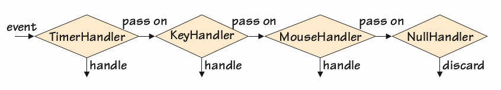

# Usage
The Chain of Responsibility Pattern is designed to decouple the sender of a
request from the recipient that processes the request. So, instead of one
function directly calling another, the first function sends a request to a chain of
receivers. The first receiver in the chain either can handle the request and stop
the chain (by not passing the request on) or can pass on the request to the next
receiver in the chain. The second receiver has the same choices, and so on, until
the last one is reached (which could choose to throw the request away or to raise
an exception).

# Way to relize

1. Conventional chain

Event is passed by one class to another, and handler only deal with the specificied event.

```python
def main():
    print("Handler Chain #1")
    handler1 = TimerHandler(KeyHandler(MouseHandler(NullHandler())))
    # Could pass None or nothing instead of the NullHandler
    while True:
        event = Event.next()
        if event.kind == Event.TERMINATE:
            break
        handler1.handle(event)


class NullHandler:

    def __init__(self, successor=None):
        self.__successor = successor


    def handle(self, event):
        if self.__successor is not None:
            self.__successor.handle(event)


class DebugHandler(NullHandler):

    def __init__(self, successor=None, file=sys.stdout):
        super().__init__(successor)
        self.__file = file


    def handle(self, event):
        self.__file.write("*DEBUG*: {}\n".format(event))
        super().handle(event)


class MouseHandler(NullHandler):

    def handle(self, event):
        if event.kind == Event.MOUSE:
            print("Click:   {}".format(event))
        else:
            super().handle(event)


class KeyHandler(NullHandler):

    def handle(self, event):
        if event.kind == Event.KEYPRESS:
            print("Press:   {}".format(event))
        else:
            super().handle(event)


class TimerHandler(NullHandler):

    def handle(self, event):
        if event.kind == Event.TIMER:
            print("Timeout: {}".format(event))
        else:
            super().handle(event)

```

2. Coroutine(协程)-based chain
Use generator send method to give event to each handler and handler use event=(yield) to accept event.
coroutine decorator used to 
```python
import Event
from Qtrac import coroutine

def coroutine(function):
    @functools.wraps(function)
    def wrapper(*args, **kwargs):
        generator = function(*args, **kwargs)
        next(generator)
        return generator
    return wrapper

def main():
    print("Handler Chain #1")
    pipeline = key_handler(mouse_handler(timer_handler()))
    while True:
        event = Event.next()
        if event.kind == Event.TERMINATE:
            break
        pipeline.send(event)            # send event to chain handler

    print("\nHandler Chain #2 (debugging)")
    pipeline = debug_handler(pipeline)
    while True:
        event = Event.next()
        if event.kind == Event.TERMINATE:
            break
        pipeline.send(event)


@coroutine
def debug_handler(successor, file=sys.stdout):
    while True:          
        event = (yield)               # accept event
        file.write("*DEBUG*: {}\n".format(event))
        successor.send(event)         # send event to next handler


@coroutine
def mouse_handler(successor=None):
    while True:
        event = (yield)
        if event.kind == Event.MOUSE:
            print("Click:   {}".format(event))
        elif successor is not None:
            successor.send(event)


@coroutine
def key_handler(successor=None):
    while True:
        event = (yield)
        if event.kind == Event.KEYPRESS:
            print("Press:   {}".format(event))
        elif successor is not None:
            successor.send(event)


@coroutine
def timer_handler(successor=None):
    while True:
        event = (yield)
        if event.kind == Event.TIMER:
            print("Timeout: {}".format(event))
        elif successor is not None:
            successor.send(event)
```